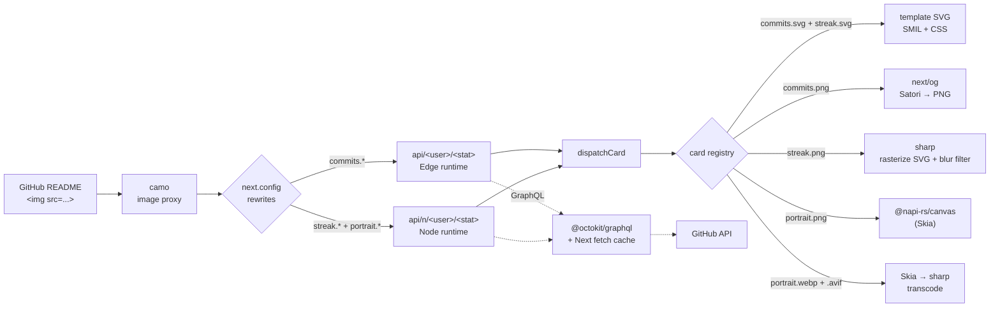

<div align="center">

# 🎴 dynimage

**Live, theme-aware, animated GitHub stat cards for README embeds.**

One URL. Adapts to the viewer's reader. Animates inside `camo`. Works everywhere `` works.

<sub>Built on Next.js 16 · Edge SVG + Satori · Skia + Sharp on Node · Zero client JS</sub>

</div>

---

## 🆕 Phase 1: bottom-up refactor

The card system was rebuilt from the data layer up for long-term extensibility — typed atoms, Zod-schema-driven cards, a `/api/meta` introspection endpoint, and a new fetch-less `text` card primitive proving the architecture handles non-GitHub data sources cleanly. Existing cards (commits, streak, portrait) below render through the new pipeline at unchanged URLs.

### New: `text` card


<sub>↑ <code>/api/\_/text.svg?text=composable%20by%20design&size=44&theme=ocean&w=520&h=100</code> · format=**svg** · runtime=**edge** · renderer=**browser** · 🎬 **none** · zero upstream fetch — the input IS the data</sub>

<br><br>


<sub>↑ <code>/api/\_/text.png?text=hello%20from%20Phase%201&size=32&theme=ember&w=400&h=80</code> · format=**png** · runtime=**edge** · renderer=**Satori** · 🖼️ **static**</sub>

<br><br>


<sub>↑ <code>text=%E2%9C%A6%20left-aligned%20in%20rose&align=left</code> · format=**svg** · runtime=**edge** · the placeholder <code>\_</code> in the path is ignored — text cards have no user dimension</sub>

### Machine-readable card catalog

The future editor reads this; you can too:

```sh
curl https://dynimage.vercel.app/api/meta | jq '.cards[] | {name, runtime, formats, dimensions: .meta.dimensions}'
```

Returns every card type, its declared runtime, supported formats, and a Zod-derived JSON Schema for its input — the editor will use this to render per-card forms without hardcoding any card name.

---

## 🆕 Phase 2: compound rendering + `/api/render`

Multiple cards composed into one image via a single base64-encoded layout spec. The URL is fully cacheable by camo — same as a regular card embed, just bigger.


<sub>↑ <code>/api/render?format=png&spec=&lt;base64-of-LayoutSpec&gt;</code> · 5 sub-cards (1 text + 2 metric + 2 bar) composed by sharp · 800×320 · ocean theme · URL is 797 chars total</sub>

### The decoded spec

```json
{
  "v": 1,
  "w": 800,
  "h": 320,
  "theme": "ocean",
  "cards": [
    {
      "type": "text",
      "input": { "text": "moefingers", "size": 36, "align": "left" },
      "x": 16,
      "y": 16,
      "w": 280,
      "h": 60
    },
    {
      "type": "metric",
      "input": { "label": "Commits last year", "value": "1247" },
      "x": 320,
      "y": 16,
      "w": 220,
      "h": 140
    },
    {
      "type": "metric",
      "input": { "label": "Active streak", "value": "42", "unit": "days" },
      "x": 560,
      "y": 16,
      "w": 220,
      "h": 140
    },
    {
      "type": "bar",
      "input": { "label": "Authored", "value": 47, "max": 60 },
      "x": 16,
      "y": 180,
      "w": 380,
      "h": 80
    },
    {
      "type": "bar",
      "input": { "label": "Test coverage", "value": 78, "max": 100 },
      "x": 410,
      "y": 180,
      "w": 380,
      "h": 80
    }
  ]
}
```

### Two ways to call it

**GET** — for `` embeds. URL contains the entire spec; camo caches like any image:

```
GET /api/render?format=png&spec=<base64-of-LayoutSpec>
GET /api/render?format=svg&spec=<base64>     # vector + animation preserved
GET /api/render?format=avif&spec=<base64>    # smallest payload
GET /api/render?format=png&spec=<base64>&z=1 # set z=1 if spec is gzipped before base64

GET /api/render?format=svg&scene=<base64url-of-Scene>      # scene/element model
GET /api/render?format=svg&c=<base64url(gzip(json))>&z=1   # Tier-2 compressed blob (editor output)
```

`?c=` is the compressed sibling of `?scene=`: the codec unwraps its versioned
envelope to a Scene and renders the identical output (`z=1` when gzipped;
omit `z` for small payloads the encoder ships raw).

**POST** — for server-to-server callers (sync scripts, build tools). JSON body, image bytes back:

```sh
curl -X POST 'https://dynimage.vercel.app/api/render?format=png' \
  -H 'content-type: application/json' \
  -d @spec.json \
  --output header.png
```

### What this unlocks

- **Editor UI** (Phase 3) — generates spec URLs from a visual canvas
- **Programmatic render-and-freeze** — callers like a museum sync script can POST a spec, save the resulting bytes into their repo, ship static images that always render (no runtime dependency on dynimage being up)
- **External-fetch cards** (Phase 4) — same spec format, new card types that fetch arbitrary user-supplied URLs and extract values via JSONPath

---

## 🖼️ Live cards

> [!NOTE]
> These cards hit the live API at `dynimage.vercel.app`. The SVG variants animate inside GitHub's `camo` image proxy via SMIL + CSS keyframes — only `<script>` is stripped, animation is not.

Each card is labeled below with its **format**, the **runtime** that serves it, and the **renderer** that produces the pixels. When debugging a broken card, the label tells you exactly which path you're looking at.

> [!NOTE]
> SVG outputs ship raw markup that **your browser** renders — fonts, emoji, SMIL animation, and `prefers-color-scheme` media queries all use the viewer's OS capabilities. Raster outputs (PNG/WebP/AVIF) are pre-rendered on the **server** by Satori, sharp, or Skia, and ship as flat pixels — server-side font availability matters.

### `commits` — Edge runtime

<picture>
  <source media="(prefers-color-scheme: dark)" srcset="https://dynimage.vercel.app/api/moefingers/commits.svg?theme=dark">
  <source media="(prefers-color-scheme: light)" srcset="https://dynimage.vercel.app/api/moefingers/commits.svg?theme=light">
  
</picture>

<sub>↑ <code>commits.svg</code> · format=**svg** · runtime=**edge** · renderer=**browser** (raw SVG passthrough) · 🎬 **animated** (SMIL count-up + CSS keyframes + sheen sweep) · `<picture>` swaps by `prefers-color-scheme`</sub>

<br><br>


<sub>↑ <code>commits.png?theme=ocean</code> · format=**png** · runtime=**edge** · renderer=**Satori** (`next/og`, JSX → SVG → PNG via WASM) · 🖼️ **static** (raster — no animation possible)</sub>

<br><br>


<sub>↑ <code>commits.png?theme=ember</code> · format=**png** · runtime=**edge** · renderer=**Satori** · 🖼️ **static**</sub>

---

### `streak` — Node runtime


<sub>↑ <code>streak.svg</code> · format=**svg** · runtime=**node** · renderer=**browser** (raw SVG passthrough) · 🎬 **animated** (SMIL pulse rings, real Gaussian blur via SVG <code>&lt;filter&gt;</code>, CSS keyframe entrance)</sub>

<br><br>


<sub>↑ <code>streak.png?theme=forest</code> · format=**png** · runtime=**node** · renderer=**sharp** (rasterizes the same SVG via librsvg) · 🖼️ **static** · text rendered via Noto Sans inlined as <code>@font-face</code> data URI; flame is an inline SVG <code>&lt;path&gt;</code> (Heroicons)</sub>

<br><br>


<sub>↑ <code>streak.png?theme=rose</code> · format=**png** · runtime=**node** · renderer=**sharp** · 🖼️ **static**</sub>

---

### `portrait` — Node runtime


<sub>↑ <code>portrait.png</code> · format=**png** · runtime=**node** · renderer=**Skia** (<code>@napi-rs/canvas</code>, imperative Canvas API with avatar compositing) · 🖼️ **static**</sub>

<br><br>


<sub>↑ <code>portrait.avif?theme=ember&w=900&h=400</code> · format=**avif** · runtime=**node** · renderer=**Skia → sharp** (Skia renders, sharp transcodes to AVIF) · 🖼️ **static**</sub>

---

### Font handling per renderer

- **`commits.png`** (Satori) — bundles a default font internally, no project-side setup needed
- **`streak.png`** (sharp via librsvg) — bundles `NotoSans-Regular.ttf` under [`src/lib/cards/fonts/`](src/lib/cards/fonts/) and inlines it as `@font-face` data URI in the SVG at render time; the 🔥 emoji was replaced with an inline SVG flame `<path>` so no emoji font is needed server-side
- **`portrait.png/.webp/.avif`** (Skia via `@napi-rs/canvas`) — uses Skia's internal font registry; falls back gracefully to system fonts

---

## 🎨 Theme gallery

The same card, six themes. Override any color via query string with raw hex (no leading `#`).

<p>
  
  
  
</p>
<p>
  
  
  
</p>

### One-off custom palette

```md

```

<p>
  
</p>

---

## 🗺️ Architecture



---

## 🔧 URL shape

```
/api/<user>/<card>.<format>?<query>
```

| segment                                                    | values                                                          |
| ---------------------------------------------------------- | --------------------------------------------------------------- |
| `card`                                                     | `commits` · `streak` · `portrait`                               |
| `format`                                                   | `svg` · `png` · `webp` · `avif` (per card; not all support all) |
| `theme`                                                    | `dark` · `light` · `ocean` · `ember` · `forest` · `rose`        |
| `bg`, `accent`, `text`, `text-muted`, `gradient`, `stroke` | hex without `#`, overrides theme                                |
| `w`, `h`                                                   | 1..4096                                                         |

Press <kbd>R</kbd> in your browser to bust the cache and see fresh data.

---

## ✨ The SVG superpowers

> [!TIP]
> GitHub's `camo` proxy serves SVG faithfully — `<script>` is stripped, but **SMIL animation, `<style>` blocks, CSS `@keyframes`, `@media (prefers-color-scheme)`, and `<foreignObject>` all work**. dynimage uses all of them.

dynimage's SVG output ships with:

- **SMIL animation** — `<animateTransform>` sheen sweeps, `<animate>` count-up, pulse rings
- **CSS keyframes** inside in-SVG `<style>` — entrance fades, transitions
- **`prefers-color-scheme` media queries** when no `theme` param is given — one URL, both modes
- **Real SVG `<filter>`** with `feGaussianBlur` — actual Gaussian blur, not faked

---

## 🚀 Deploy your own

<details>
<summary><strong>Click to expand setup</strong></summary>

```sh
git clone https://github.com/moefingers/dynimage
cd dynimage
pnpm install
cp .env.example .env.local           # add your GITHUB_TOKEN
pnpm dev                              # http://localhost:3000

# Production
vercel link
vercel env add GITHUB_TOKEN production preview development
vercel --prod
```

The `GITHUB_TOKEN` must be a fine-grained PAT with read-only public repo metadata access. Create one at [github.com/settings/tokens?type=beta](https://github.com/settings/tokens?type=beta).

</details>

> [!IMPORTANT]
> The cards above will return `502` until `GITHUB_TOKEN` is set in the Vercel project envs and the project is redeployed.

---

## 🧱 Adding a card

<details>
<summary><strong>Three steps, no architectural decisions left to revisit</strong></summary>

1. Create [`src/lib/cards/<name>.ts`](src/lib/cards/) exporting a `Card<TData>` — data fetcher, renderer per format, declared runtime
2. Add it to [`src/lib/cards/registry-edge.ts`](src/lib/cards/registry-edge.ts) **or** [`registry-node.ts`](src/lib/cards/registry-node.ts) (pick the one matching your runtime) and to [`registry-meta.ts`](src/lib/cards/registry-meta.ts) for the homepage demo grid
3. If `runtime: 'nodejs'`, add the new card name to the regex group in [`next.config.ts`](next.config.ts) rewrites

</details>

---

## 🧰 Stack

| layer              | choice                                           | why                                                                 |
| ------------------ | ------------------------------------------------ | ------------------------------------------------------------------- |
| Framework          | Next.js 16 App Router                            | dual runtime per route, file-based catch-all, `next/og` built in    |
| Type system        | TypeScript strict + `noUncheckedIndexedAccess`   | per zcanon canon                                                    |
| Edge PNG           | `next/og` (Satori + Resvg)                       | Vercel-native, JSX-driven, no native deps                           |
| Edge real-blur PNG | `@resvg/resvg-wasm`                              | hand-authored SVG with `<filter feGaussianBlur>` rasterized on Edge |
| Node PNG           | `@napi-rs/canvas` (Skia)                         | full Canvas API, same engine as Chrome                              |
| Node transcode     | `sharp`                                          | AVIF/WebP, best compression                                         |
| GitHub data        | `@octokit/graphql` + `next: { revalidate: 300 }` | one round-trip per card, shared cache                               |
| Package manager    | pnpm                                             | per zcanon canon                                                    |

---

## 📐 Math

Why does the streak's blur look right at any DPR? Because SVG `<filter>` operates in user-space units, which the rasterizer scales:

$$
\sigma_{\text{px}} = \sigma_{\text{user}} \cdot \frac{w_{\text{px}}}{w_{\text{user}}}
$$

The blur kernel grows with the output resolution, so the _visual_ blur radius stays constant. No "looks fuzzy at 4x" artifacts.

---

## 🎬 What this README is also demonstrating

<details>
<summary><strong>Every GitHub-flavored-markdown trick used above</strong></summary>

| Technique                                        | Where                                         |
| ------------------------------------------------ | --------------------------------------------- |
| `<picture>` with `<source media>`                | commits theme-responsive embed at top         |
| Animated SVG embed                               | streak, commits                               |
| `prefers-color-scheme` inside the SVG            | when no `theme=` param                        |
| `> [!NOTE]` / `[!TIP]` / `[!IMPORTANT]` callouts | throughout                                    |
| `<details>` / `<summary>` collapsibles           | setup, adding cards, this section             |
| `<kbd>` keyboard chips                           | URL shape section                             |
| `<div align="center">` heading                   | top of README                                 |
| `<sub>` for sub-text                             | top of README                                 |
| Mermaid diagram                                  | architecture section                          |
| LaTeX math (`$$...$$`)                           | the "why blur scales correctly" section above |

</details>

---

<div align="center">

<sub>Repo: <a href="https://github.com/moefingers/dynimage">github.com/moefingers/dynimage</a> · API: <a href="https://dynimage.vercel.app">dynimage.vercel.app</a></sub>

</div>
